<!--
  Showcase README for MAConglomo Hub.
  This repo is documentation only — the application source code is private.
-->

  <picture>
    <source media="(prefers-color-scheme: dark)" srcset="assets/logo-dark.png">
    
  </picture>

<h1 align="center">MAConglomo Hub</h1>

  <em>An internal management system for a medical distribution company — 
  batch-level drug inventory, an auditable stock ledger, and field logging for medical representatives.</em>

  
  
  
  
  
  
  

---

## 📖 Overview

**MAConglomo Hub** is the internal back-office system for a medical distribution
company. It replaces spreadsheet-and-paper workflows with one role-aware web app
covering the two halves of the business: what is **in the warehouse**, and what
the **field team** is doing.

The system tracks medicines down to the individual **batch** — batch number,
expiry date, unit cost — and records every movement of stock as an immutable
ledger entry rather than a mutable counter. Medical representatives log their
client visits and pre/post-call notes from the field, with photo proof, and
administrators get read access to all of it plus a full audit trail.

Three roles, each with a distinct dashboard and a server-enforced permission
boundary:

| Role | Owns |
|---|---|
| **Admin** | Account approvals, employee management, oversight of everything, audit logs |
| **Inventory Keeper** | Medicine catalog, incoming/outgoing stock, batches, stock cards |
| **MedRep** | Own client coverage logs and pre/post call logs, own PDF exports |

> This project was a **refurbishment**: an existing working application was taken
> as a baseline, then re-architected for security, data integrity, and a
> consistent design system, and deployed to the client's hosting.

---

## ✨ Key Features

### Inventory & stock control
- **Batch-level tracking** — every medicine is stocked as dated batches with their
  own batch number, expiry, quantity, and unit cost.
- **Append-only stock ledger** — receiving and dispensing both write `IN` / `OUT`
  transactions. On-hand stock is *derived* (`SUM(IN) − SUM(OUT)`), never edited
  in place, so the history can always be reconstructed.
- **Stock cards** — per-batch ledger view with a running balance after every
  movement, sortable, exportable to PDF.
- **Expiry surfacing** — inventory rows are badged *Expired* / *Near expiry* /
  *General*, and dashboards raise a banner counting expired stock still on hand.
- **Batch archiving** — retire a batch without destroying its transaction history.

### Field team (medical representatives)
- **Client coverage logs** — date, client, hospital/clinic, and products covered.
- **Pre/post call logs** — the plan going into a visit and the outcome coming out.
- **Photo proof of visit** — capture directly from the device camera or upload a
  file; images are validated, renamed, and stored outside the web-executable path.
- **Search, date filtering, and pagination** across both log types.
- **Self-service PDF exports** of a rep's own coverage and call history.

### Administration & oversight
- **Registration approval queue** — new sign-ups stay inert until an admin
  approves them; there is no self-service admin signup.
- **Employee management** — enable/disable accounts, force a password reset, or
  delete, with search and role/status filters. Disabling an account **ends its
  live session immediately**, not at next login.
- **Audit trail** — a user-activity log (approvals, rejections, enable/disable,
  deletions) and the complete stock-movement ledger, both filterable by date,
  action type, and free-text search.
- **Cross-role visibility** — admins can open any rep's logs and any batch's
  stock card, and export the same PDFs the owners can.
- **Dashboards** — inventory value at cost, product counts, near-expiry and
  expired counts, pending approvals, and 30-day activity charts.

---

## 🖼️ Screenshots

| Sign-in | Admin Dashboard |
|:---:|:---:|
| 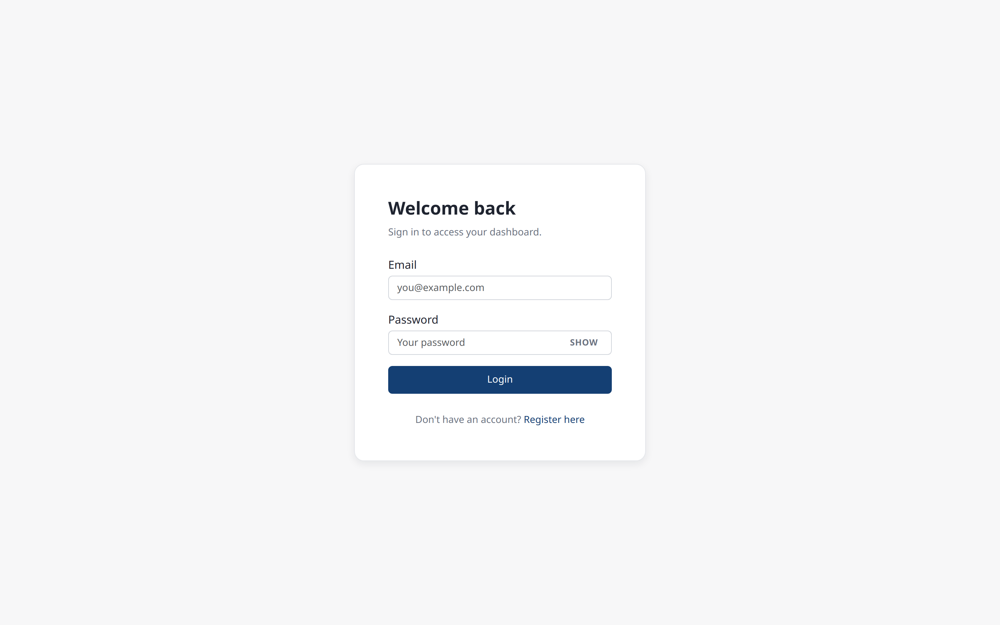 | 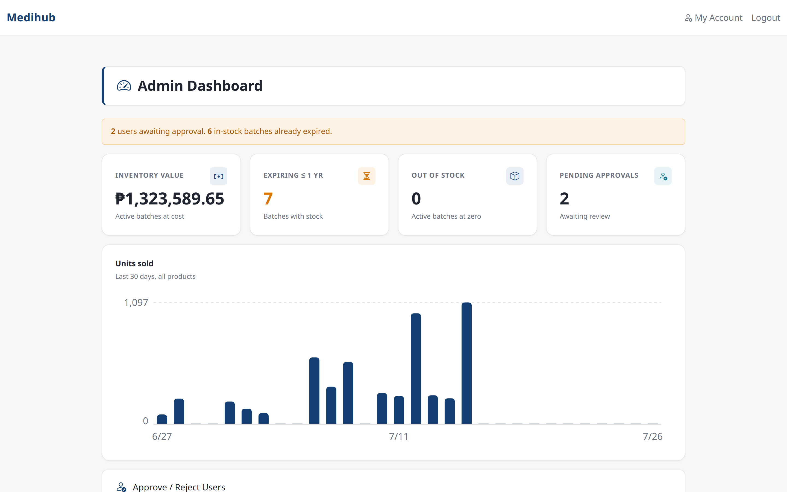 |
| **Inventory Dashboard** | **Inventory — batch list with expiry status** |
| 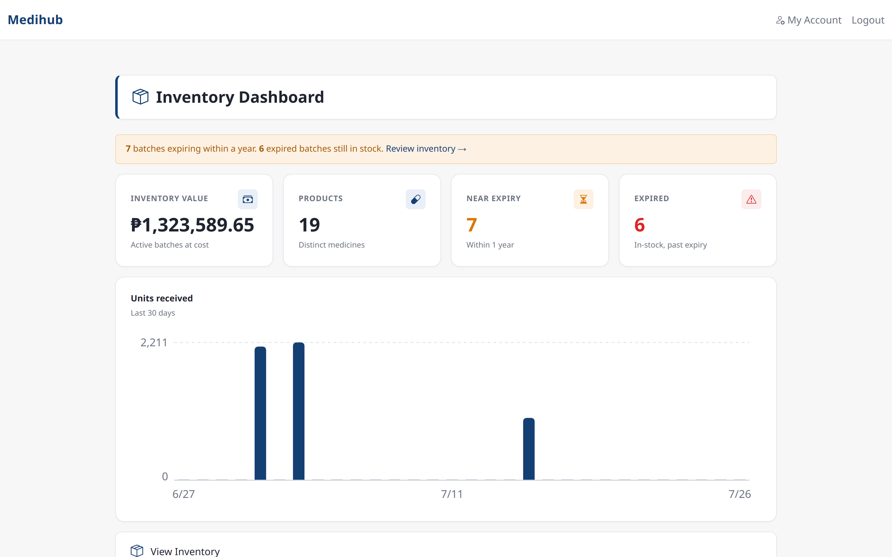 | 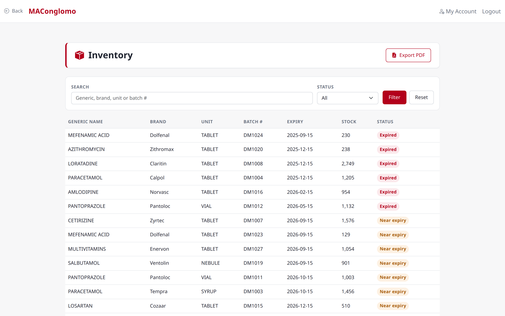 |
| **Stock Card — per-batch running balance** | **Stock Movement Ledger** |
| 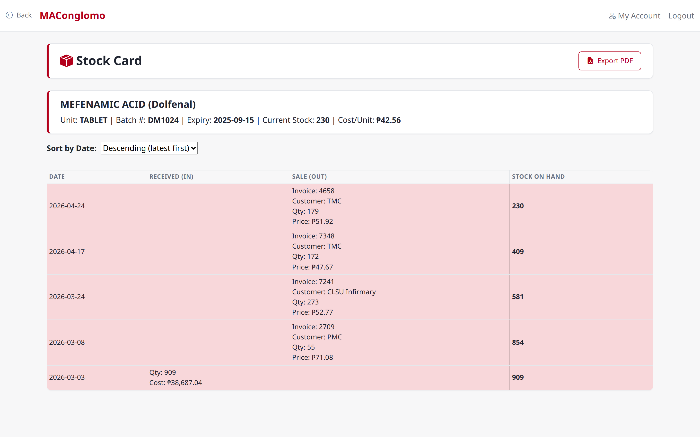 | 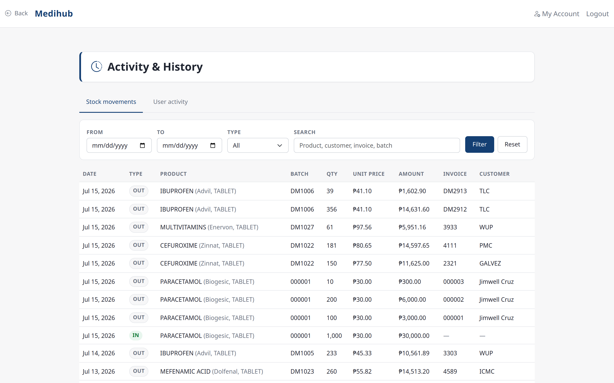 |
| **User Activity Audit Log** | **Registration Approval Queue** |
| 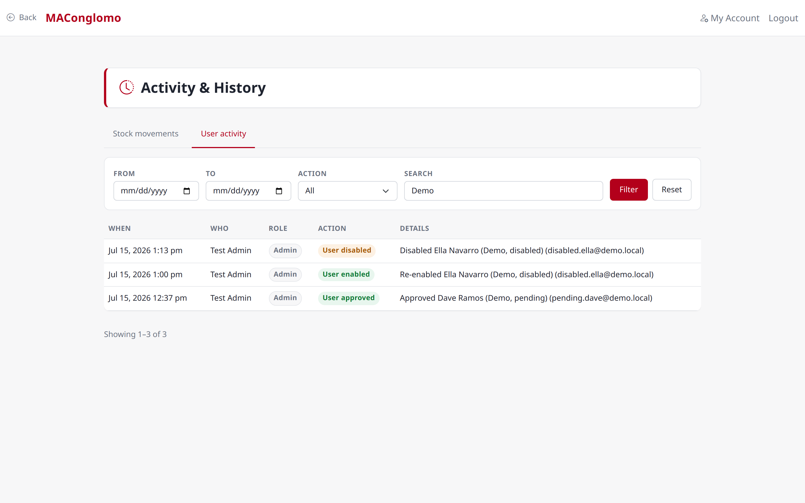 | 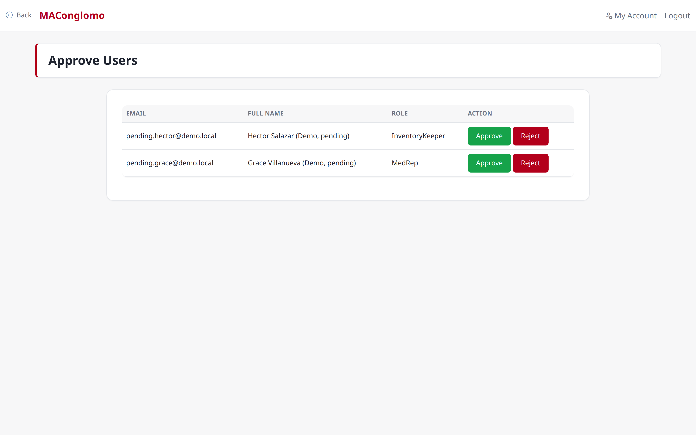 |
| **Employee Management** | **MedRep — Client Coverage Logs** |
| 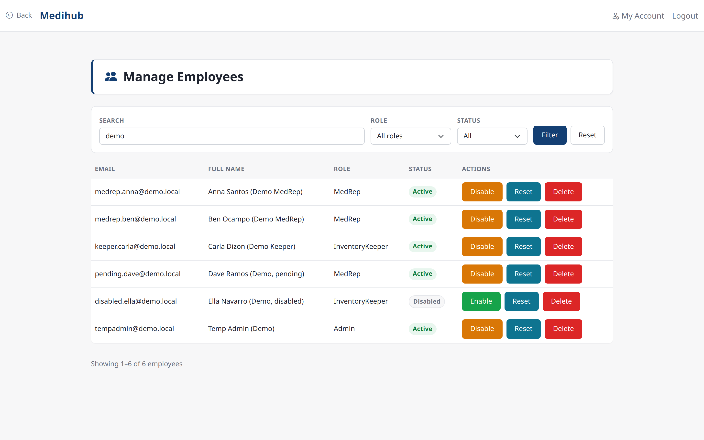 | 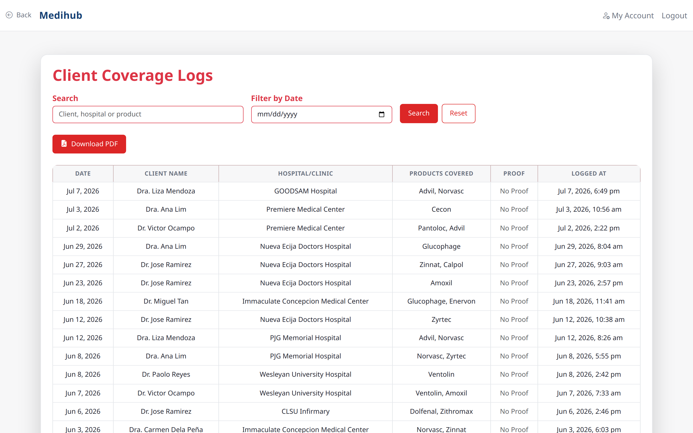 |
| **MedRep — Pre/Post Call Logs** | **MedRep — Log a visit with photo proof** |
| 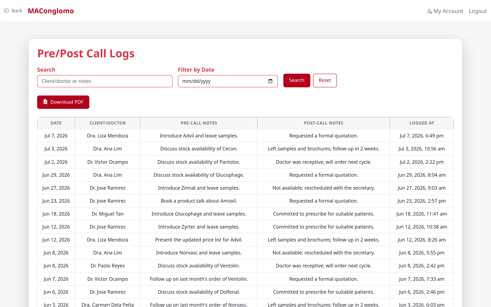 | 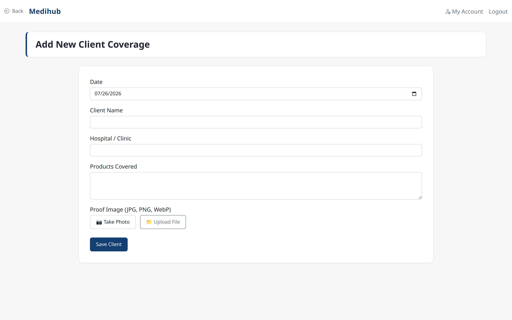 |

Screenshots are taken against a seeded demo dataset — no real client, patient, or employee data appears above.

---

## 🧱 Tech Stack

| Layer | Technology |
|---|---|
| **Backend** | PHP 8.3, procedural, **no framework**, server-rendered pages |
| **Database** | MySQL 8 via PDO — prepared statements throughout, exceptions on, emulation off |
| **Frontend** | Bootstrap 5.3 + Bootstrap Icons, plus a custom token-based stylesheet |
| **Charts** | Inline SVG rendered **server-side** — no JavaScript charting library |
| **PDF export** | [dompdf](https://github.com/dompdf/dompdf) 3.x |
| **Auth** | Session-based, bcrypt password hashing |
| **Build step** | None — edit PHP/CSS and reload |

### Engineering highlights

- **Stock integrity under concurrency.** The transaction ledger is authoritative
  and `stock_on_hand` is only a cache. Any write that moves stock runs inside a
  DB transaction, and dispensing takes a `SELECT … FOR UPDATE` lock on the batch
  row before checking and decrementing — so two simultaneous sales cannot
  oversell the same batch.
- **Audit rows outlive the people in them.** Deleting an admin who once approved
  someone nulls the reference (`ON DELETE SET NULL`) instead of failing or
  cascading, so the approval history survives and simply reads "Deleted admin".
- **Document root is `public/`.** Config, includes, migrations, Composer
  `vendor/`, and the schema dump all live *above* the web root and are not
  reachable over HTTP; `.htaccess` rules are a second layer, not the primary one.
- **Zero-JS charts.** Dashboard bar charts are generated as inline SVG on the
  server, which keeps the Content-Security-Policy strict and adds no dependency.
- **Safe first-run bootstrap.** A one-time setup page creates the very first
  admin account and self-disables the moment an admin exists — so a fresh
  deployment can be handed to the client with an empty database.

### Security

- **CSRF tokens** verified on every state-changing POST.
- **Password policy** enforced on every password-setting flow, with a
  force-change-on-next-login flag for admin-issued resets.
- **Login throttling** — 8 failed attempts per IP/email within 15 minutes.
- **Server-side role checks** at the top of every page; hidden UI is never the
  access control.
- **Security headers on every response** — CSP, `X-Frame-Options: DENY`,
  `X-Content-Type-Options: nosniff`, `Referrer-Policy`, and HSTS over HTTPS.
  Session cookies are HttpOnly, SameSite=Lax, and Secure over HTTPS.
- **Output encoding** on all user-derived output; exception messages are logged
  server-side and never shown to users.
- **Upload hardening** — MIME sniffed on the temp file, size capped, randomised
  filenames, and script execution denied inside the upload directory.
- **PDF generation** runs with remote fetching disabled and images embedded as
  base64, so a document can never be used to pull a remote resource.

---

## 🎨 Design System

A single stylesheet is the source of truth, built entirely from CSS custom
properties — colors, spacing, type scale, radii, and shadows are all tokens, and
pages are assembled from a fixed component vocabulary rather than ad-hoc CSS.
Every page renders through one shared layout shell.

| Token | Value |
|---|---|
| Primary (brand red) | `#b3001b` |
| Surface / background | `#ffffff` / light neutral |
| Type stack | `Inter`, falling back to the OS system font |
| Spacing scale | 4px base, `--space-1` … `--space-8` |
| Radii | `6px` / `10px` / `14px` |

Intentionally **light-theme only**, flat, and corporate — the visual language of
an internal tool that people use all day, not a marketing site.

---

## 🚀 Status

Deployed and in production on the client's shared hosting. The live instance is
an internal system behind a login wall and is not linked publicly.

---

## 👤 Author

**Jimwell Julian J. Cruz** — design, development, hardening, and deployment.

---

## 📄 License & Usage

**© 2026 Jimwell Julian J. Cruz. All Rights Reserved.**

This repository is a **project showcase**. The application's source code is
proprietary and is **not** publicly available or open source. The screenshots,
branding, and descriptions here are provided for portfolio and informational
purposes only and may not be reused without permission.

---

MA Conglomo Med Corp · Philippines

